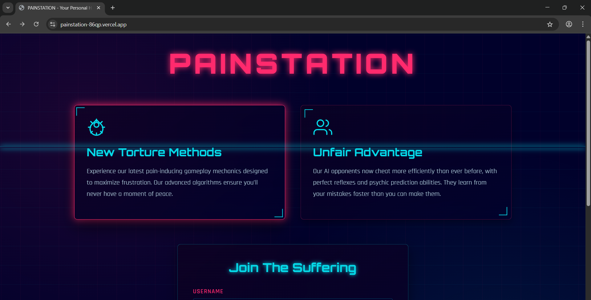
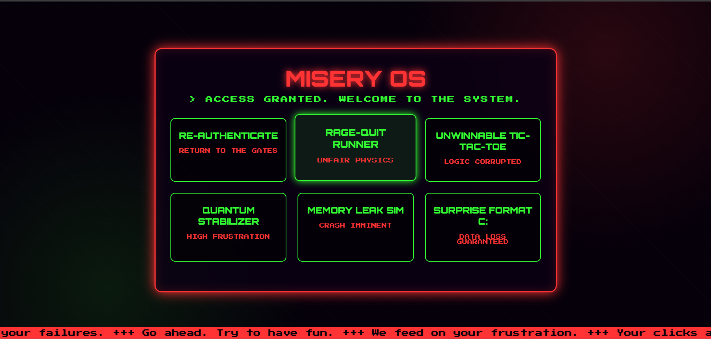
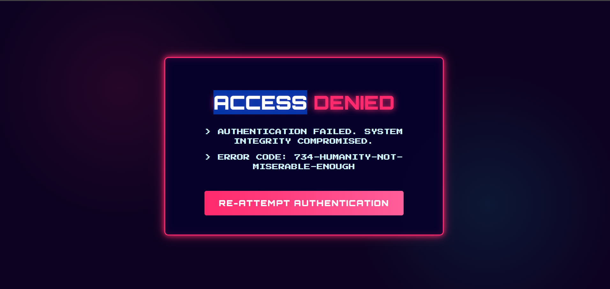
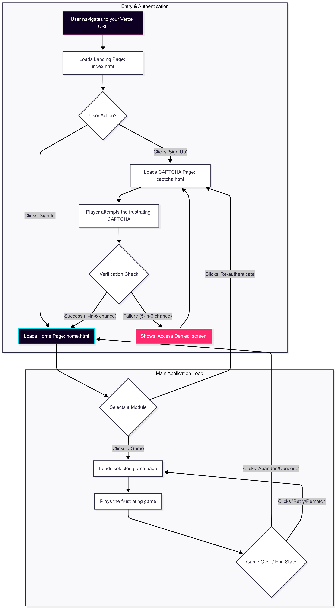

Project Name: PainStation 

Team Name: Jet2Holiday 
 
Team Members  
Member 1: Vishnu Sarang - Government Engineering College, Thrissur  
Member 2: Rahul Arun - Government Engineering College, Thrissur  

Project Description  
PainStation is a gaming platform featuring intentionally frustrating game experiences designed to test players' patience and perseverance. The system includes an AI opponent that uses strategic cheating and psychological warfare.  

The Problem (that doesn't exist)  
In today's overly accommodating digital landscape, games have become far too enjoyable. Players expect:  
- Fairness and balanced gameplay  
- Intuitive controls and clear rules  
- Positive reinforcement and rewards  
  This coddling has created a generation of gamers with unrealistic expectations about life's inherent frustrations.  

The Solution (that nobody asked for)  
PainStation solves this non-issue by providing:  
1. An AI opponent that cheats with creative enthusiasm  
2. Game mechanics that evolve to exploit your weaknesses    
3. Oh, did i forget to mention the AI also trash talks you  

Technical Details  
Technologies Used:  
- Frontend: HTML5, CSS3, JavaScript  
- Hosting: Vercel  
- Tools: VS Code, Git/GitHub  

Implementation  
git clone https://github.com/Jet2Holiday/PainStation.git  
cd PainStation  
npm install  
npm start   

Project Documentation  

Screenshots:  

 
 

Workflow Diagram:  
Workflow workflow.png Basic system architecture showing user input and AI response patterns  

Team Contributions  
Vishnu Sarang: Frontend + Presentation 
Rahul Arun: Backend + Frontend
